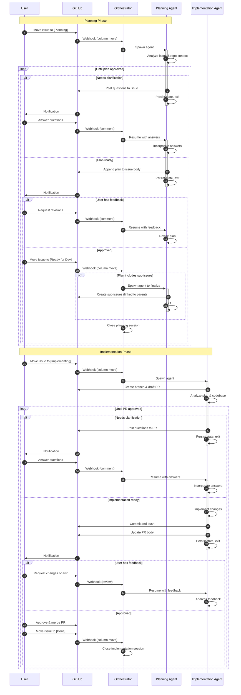

# User Workflow

This document details the workflow for using Kitchen. Issues flow through two main phases: Planning and Implementation.

## Workflow Diagram

## Sub-Issues

Sub-issues independently flow through the same Planning → Implementation cycle. This enables breaking down complex work into manageable pieces while maintaining traceability to the parent issue.

## Key Principles

- **Human-in-the-loop**: Agents never move tickets, merge PRs, or mark work complete
- **Observable**: All agent activity is visible through issue comments and PR updates
- **Iterative**: Users can request revisions at any stage through comments
