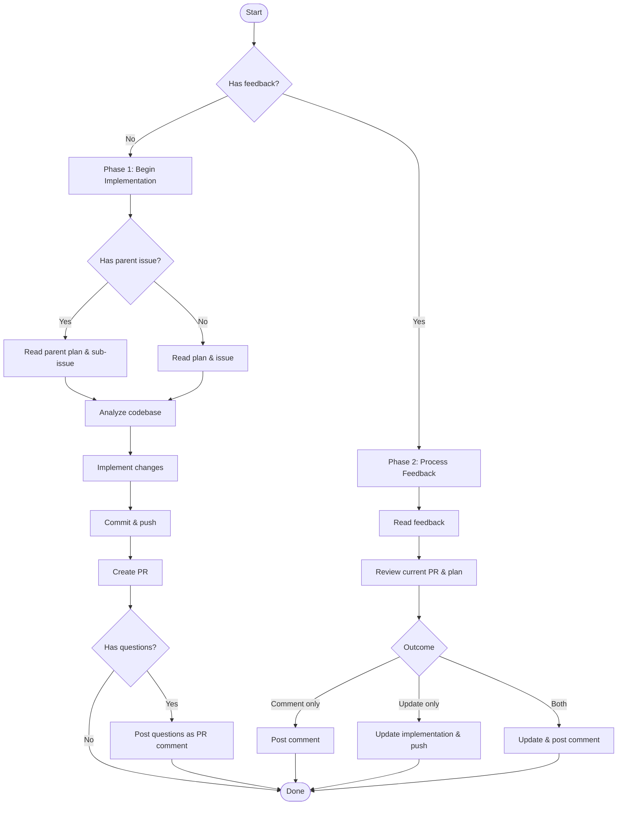

# Implementation Workflow

```mermaid
flowchart TD
    Start([Start]) --> HasFeedback{Has feedback?}

    HasFeedback -->|No| BeginImpl[Phase 1: Begin Implementation]
    HasFeedback -->|Yes| ProcessFeedback[Phase 2: Process Feedback]

    BeginImpl --> HasParent{Has parent issue?}
    HasParent -->|Yes| ReadParentPlan[Read parent plan & sub-issue]
    HasParent -->|No| ReadPlan[Read plan & issue]

    ReadParentPlan --> AnalyzeCodebase[Analyze codebase]
    ReadPlan --> AnalyzeCodebase

    AnalyzeCodebase --> Implement[Implement changes]
    Implement --> CommitPush[Commit & push]
    CommitPush --> CreatePR[Create PR]
    CreatePR --> HasQuestions{Has questions?}

    HasQuestions -->|Yes| PostQuestions[Post questions as PR comment]
    HasQuestions -->|No| Done([Done])
    PostQuestions --> Done

    ProcessFeedback --> ReadFeedback[Read feedback]
    ReadFeedback --> ReviewPR[Review current PR & plan]
    ReviewPR --> DecideFeedbackOutcome{Outcome}

    DecideFeedbackOutcome -->|Comment only| PostComment[Post comment]
    DecideFeedbackOutcome -->|Update only| UpdateImpl[Update implementation & push]
    DecideFeedbackOutcome -->|Both| UpdateAndComment[Update & post comment]

    PostComment --> Done
    UpdateImpl --> Done
    UpdateAndComment --> Done
```
