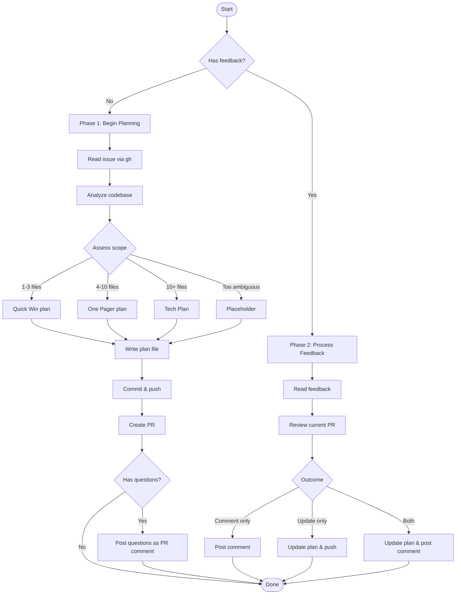

# Planning Workflow

```mermaid
flowchart TD
    Start([Start]) --> HasFeedback{Has feedback?}

    HasFeedback -->|No| BeginPlanning[Phase 1: Begin Planning]
    HasFeedback -->|Yes| ProcessFeedback[Phase 2: Process Feedback]

    BeginPlanning --> ReadIssue[Read issue via gh]
    ReadIssue --> AnalyzeCodebase[Analyze codebase]
    AnalyzeCodebase --> AssessScope{Assess scope}

    AssessScope -->|1-3 files| QuickWin[Quick Win plan]
    AssessScope -->|4-10 files| OnePager[One Pager plan]
    AssessScope -->|10+ files| TechPlan[Tech Plan]
    AssessScope -->|Too ambiguous| Placeholder[Placeholder]

    QuickWin --> WritePlan[Write plan file]
    OnePager --> WritePlan
    TechPlan --> WritePlan
    Placeholder --> WritePlan

    WritePlan --> CommitPush[Commit & push]
    CommitPush --> CreatePR[Create PR]
    CreatePR --> HasQuestions{Has questions?}

    HasQuestions -->|Yes| PostQuestions[Post questions as PR comment]
    HasQuestions -->|No| Done([Done])
    PostQuestions --> Done

    ProcessFeedback --> ReadFeedback[Read feedback]
    ReadFeedback --> ReviewPR[Review current PR]
    ReviewPR --> DecideFeedbackOutcome{Outcome}

    DecideFeedbackOutcome -->|Comment only| PostComment[Post comment]
    DecideFeedbackOutcome -->|Update only| UpdatePlan[Update plan & push]
    DecideFeedbackOutcome -->|Both| UpdateAndComment[Update plan & post comment]

    PostComment --> Done
    UpdatePlan --> Done
    UpdateAndComment --> Done
```
