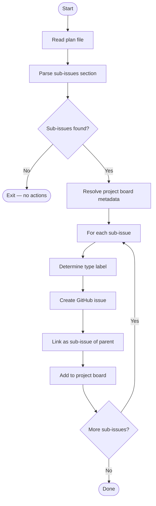

# Sub-Issues Workflow

```mermaid
flowchart TD
    Start([Start]) --> ReadPlan[Read plan file]
    ReadPlan --> ParseSubIssues[Parse sub-issues section]
    ParseSubIssues --> HasSubIssues{Sub-issues found?}

    HasSubIssues -->|No| Exit([Exit — no actions])
    HasSubIssues -->|Yes| SetupProject[Resolve project board metadata]

    SetupProject --> ForEach[For each sub-issue]
    ForEach --> DetermineLabel[Determine type label]
    DetermineLabel --> CreateIssue[Create GitHub issue]
    CreateIssue --> LinkParent[Link as sub-issue of parent]
    LinkParent --> AddToBoard[Add to project board]
    AddToBoard --> MoreSubIssues{More sub-issues?}

    MoreSubIssues -->|Yes| ForEach
    MoreSubIssues -->|No| Done([Done])
```
