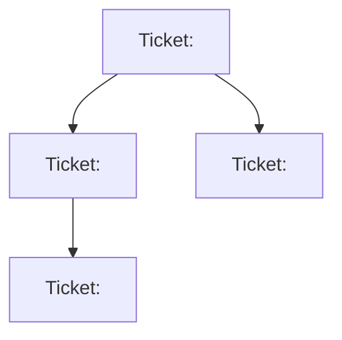

# Tech Plan: <title>

## Context

**Ticket:** <link to Linear ticket>

<What this work is and why it's needed. 2-3 sentences.>

## Approach

<High-level strategy. Key architectural decisions and trade-offs.>

### Key Decisions

<Trade-offs considered. Why this approach over alternatives.>

## Implementation Tickets

<List of tickets to create after this plan is approved. Each should be independently deliverable.>

## Testing Strategy

<How to verify the overall implementation is correct.>

## Risks & Open Questions

<Anything unresolved. Risks to call out. Dependencies.>
